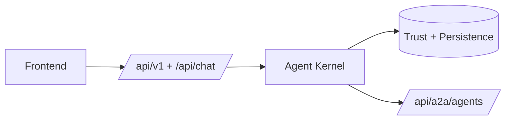

# Career AI

Trust-first recruiting platform with verified Career ID, consented access, and agent-backed workflows.

## What this is

Career AI is a single Next.js application for candidate identity, recruiter workflows, and secure data sharing. Candidates own a persisted Career ID with audit-backed trust data. Recruiters can search recruiter-safe candidate summaries, request access to deeper data, and view approved scope only after consent. The platform includes product APIs, internal agent routes, and external A2A-compatible endpoints on the same shared kernel.

## Core flow

**Recruiter**

- search candidates
- request Career ID access
- view verified or private data only after approval

**Candidate**

- receive access requests
- approve or reject requests
- revoke access at any time

## Architecture

The product runs as one app with standard product routes, a shared agent kernel, and durable trust data underneath. Some product flows still call domain services directly, while selected recruiter flows now delegate into the agent boundary.



## A2A

External agent endpoints exist today for candidate, recruiter, and verifier agents. The boundary is versioned as `a2a.v1`, authenticated with service tokens, and rate-limited.

```json
{
  "version": "a2a.v1",
  "agentType": "candidate",
  "operation": "respond",
  "payload": { "message": "..." }
}
```

## Run locally

```bash
npm install
npm run dev
```

Minimum environment:

- `DATABASE_URL`
- `JOB_SEARCH_RETRIEVAL_V2_ENABLED=true`
- auth config (`NEXTAUTH_URL` or `AUTH_URL`, `NEXTAUTH_SECRET` or `AUTH_SECRET`, Google OAuth vars)
- `EXTERNAL_A2A_ENABLED`
- `EXTERNAL_AGENT_AUTH_TOKENS`
- `OPENAI_API_KEY` (optional for non-LLM-only local work)
- one or more jobs inventory source envs when you want live refreshes (`GREENHOUSE_BOARD`, `LEVER_SITE_NAMES`, `ASHBY_JOB_BOARDS`, `JOBS_AGGREGATOR_FEEDS`, `JOBS_AGGREGATOR_FEED_URL`, `WORKABLE_XML_FEED_URL`, `WORKDAY_JOB_SOURCES`)
- autonomous apply envs when testing one-click apply (`AUTONOMOUS_APPLY_ENABLED`, inline worker/concurrency/timeouts, and optional LangSmith key/project vars in `.env.example`)

Copy `.env.example` to `.env.local` and run `npm run db:migrate` when using the Postgres-backed local path.

## Autonomous Apply (Workday-Only Phase)

Current production implementation status:

- autonomous apply foundation is live behind `AUTONOMOUS_APPLY_ENABLED`
- queueing, persistence, runtime orchestration, artifacts, and terminal email notifications are implemented
- end-to-end autonomous submission is implemented only for Workday targets
- Greenhouse, Lever, and generic hosted forms are detected but intentionally not automated in this phase
- non-Workday targets now return `open_external` immediately in Workday-only mode and do not queue runs

### User and API visibility

- `POST /api/v1/jobs/apply-click` performs Workday-only gating and either queues or returns `open_external`
- `GET /api/v1/apply-runs` returns authenticated run list/status for the signed-in user
- `GET /api/v1/apply-runs/:runId` returns authenticated run detail and event timeline
- account UI now includes `/account/apply-runs` and `/account/apply-runs/:runId` for status visibility

### Trace Correlation Path

Each newly queued autonomous Workday run gets a `trace_id` that is propagated across:

- API request correlation metadata on `apply_runs.metadata_json`
- `apply_runs.trace_id`
- `apply_run_events.trace_id`
- LangSmith/LangGraph trace metadata and tags (`trace:<trace_id>`)

### Runtime model and limits

- worker execution is currently inline/in-process (`AUTONOMOUS_APPLY_INLINE_WORKER_ENABLED`)
- bounded concurrency is enforced (`AUTONOMOUS_APPLY_INLINE_WORKER_CONCURRENCY`, max 4)
- timeout, stuck-run, and artifact retention controls are centralized in env config
- retries are intentionally conservative in inline mode to avoid duplicate submissions

See the operator runbook for rollout verification and rollback:

- [Autonomous Apply Workday Ops Runbook](./docs/ops/autonomous-apply-workday-runbook.md)

## Repo structure

- `app/` -> routes and UI
- `packages/` -> domain logic, agent runtime, and (as of the monorepo consolidation) the protocol packages (`a2a-protocol`, `badge-schemas`, `vc-toolkit`, `did-resolver`, `sync-adapter-sdk`, `chain-client`) plus `pdf-signature-verifier`
- `lib/` -> auth, tracing, A2A, and shared adapters
- `db/` -> migrations
- `services/` -> standalone HTTP services: api-gateway (:8080, owns ledger routes + in-process document verification) and pdf-extractor (:8788, kept separate for trust-boundary reasons — parses untrusted PDF binaries). Each deploys independently on Railway.
- `infra/` -> `docker-compose.yml` (shared local Postgres on :5433) and placeholders for db/kms/events configs
- `docs/ledger/` -> architecture, threat model, feature tracker, and planning specs for the career-ledger side of the system (merged in from `fsyeddev/career-ledger`)

## Status

- ✅ Product workflows working
- ✅ Internal and external agent boundaries exist
- ⚠️ Not all product flows route through agents yet
- ⚠️ True multi-agent chaining is not implemented

## Docs

- [Autonomous apply system diagrams](./docs/architecture/autonomous-apply-system.md)
- [Autonomous Apply Workday Ops Runbook](./docs/ops/autonomous-apply-workday-runbook.md)
- [Current-state architecture](./docs/architecture/current-state-agent-platform.md)
- [Docs index](./docs/README.md)
- [Ledger architecture](./docs/ledger/architecture.md)
- [Ledger threat model](./docs/ledger/threat-model.md)
- [Ledger planning specs](./docs/ledger/planning/specs/)
