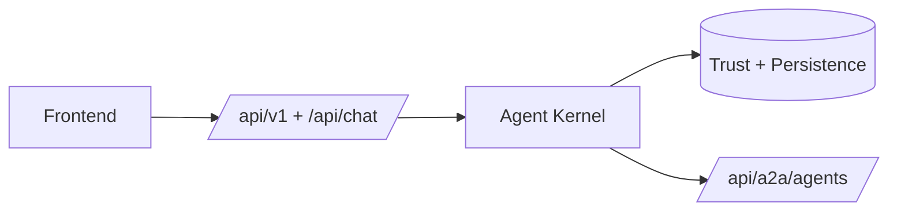

# Career AI

Trust-first recruiting platform with verified Career ID, consented access, and agent-backed workflows.

## What this is

Career AI is a single Next.js application for candidate identity, recruiter workflows, and secure data sharing. Candidates own a persisted Career ID with audit-backed trust data. Recruiters can search recruiter-safe candidate summaries, request access to deeper data, and view approved scope only after consent. The platform includes product APIs, internal agent routes, and external A2A-compatible endpoints on the same shared kernel.

## Core flow

**Recruiter**

- search candidates
- request Career ID access
- view verified or private data only after approval

**Candidate**

- receive access requests
- approve or reject requests
- revoke access at any time

## Architecture

The product runs as one app with standard product routes, a shared agent kernel, and durable trust data underneath. Some product flows still call domain services directly, while selected recruiter flows now delegate into the agent boundary.



## A2A

External agent endpoints exist today for candidate, recruiter, and verifier agents. The boundary is versioned as `a2a.v1`, authenticated with service tokens, and rate-limited.

```json
{
  "version": "a2a.v1",
  "agentType": "candidate",
  "operation": "respond",
  "payload": { "message": "..." }
}
```

## Run locally

```bash
npm install
npm run dev
```

Minimum environment:

- `DATABASE_URL`
- auth config (`NEXTAUTH_URL` or `AUTH_URL`, `NEXTAUTH_SECRET` or `AUTH_SECRET`, Google OAuth vars)
- `EXTERNAL_A2A_ENABLED`
- `EXTERNAL_AGENT_AUTH_TOKENS`
- `OPENAI_API_KEY` (optional for non-LLM-only local work)

Copy `.env.example` to `.env.local` and run `npm run db:migrate` when using the Postgres-backed local path.

## Repo structure

- `app/` -> routes and UI
- `packages/` -> domain logic and agent runtime
- `lib/` -> auth, tracing, A2A, and shared adapters
- `db/` -> migrations

## Status

- ✅ Product workflows working
- ✅ Internal and external agent boundaries exist
- ⚠️ Not all product flows route through agents yet
- ⚠️ True multi-agent chaining is not implemented

## Docs

- [Current-state architecture](./docs/architecture/current-state-agent-platform.md)
- [Docs index](./docs/README.md)
