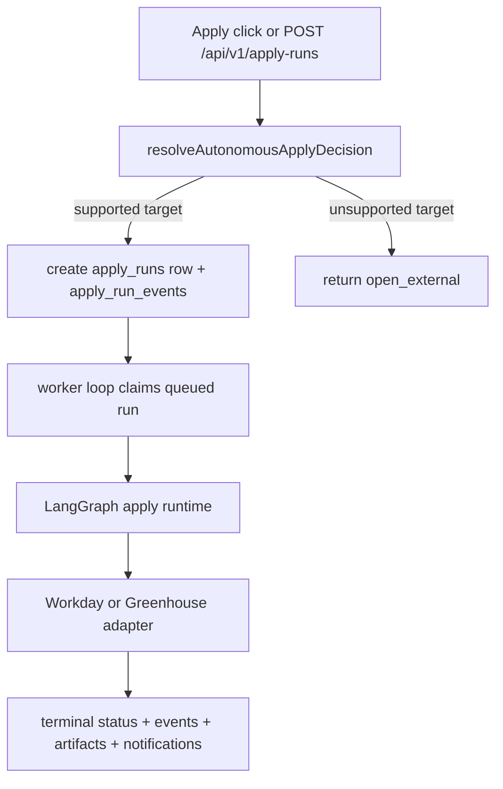

# Autonomous Apply System

Autonomous apply is a real subsystem in this repo. It is not limited to Workday anymore.

## Scope

- Feature flag: `AUTONOMOUS_APPLY_ENABLED`
- Supported ATS families for queueable runs: `workday` and `greenhouse`
- Unsupported families such as `lever`, `generic_hosted_form`, and unknown targets return `open_external`
- Run creation requires Postgres-backed persistence

Supported-target detection lives in `packages/apply-adapters/src/resolver.ts`.

## Entry Points

- `POST /api/v1/jobs/apply-click`
- `POST /api/v1/apply-runs`
- `GET /api/v1/apply-runs`
- `GET /api/v1/apply-runs/[runId]`

The jobs page and account UI consume those routes for queueing and status visibility.

## Runtime Flow

## Worker Modes

- Default worker mode is effectively inline.
- `scripts/run-autonomous-apply-worker.ts` can run the same polling loop out of the request path.
- `AUTONOMOUS_APPLY_WORKER_MODE` accepts `inline`, `external`, or `disabled`.
- External mode is only treated as queue-ready when shared S3 blob storage is configured. Without that, availability returns `external_worker_requires_shared_blob_storage`.

## Persistence And Artifacts

Durable tables:

- `apply_runs`
- `apply_run_events`
- profile snapshot records used by autonomous apply

Artifacts are stored under `apply-runs/<runId>/...` through the autonomous-apply artifact helpers. Storage depends on the configured artifact/blob driver.

## Adapters And Outcomes

- The runtime currently registers `workdayApplyAdapter` and `greenhouseApplyAdapter`.
- Expected terminal states include `submitted`, `failed`, `needs_attention`, and `submission_unconfirmed`.
- Login and CAPTCHA issues are surfaced as attention-needed failures instead of silent retries.

## Observability

- Each run gets a `trace_id`.
- `apply_runs.trace_id` and `apply_run_events.trace_id` carry that correlation.
- LangSmith tracing is used by the autonomous-apply runtime when configured.
- Status APIs derive `stuck_queued` and `stuck_in_progress` markers from environment-configured thresholds.

## Current Limits

- There is no scheduler in this repo. The worker loop only runs when the app process or explicit worker script is running.
- Unsupported ATS targets always fall back to `open_external`.
- External worker mode is configuration-aware, but this repo does not contain a separate deployment target beyond the worker-loop script.
