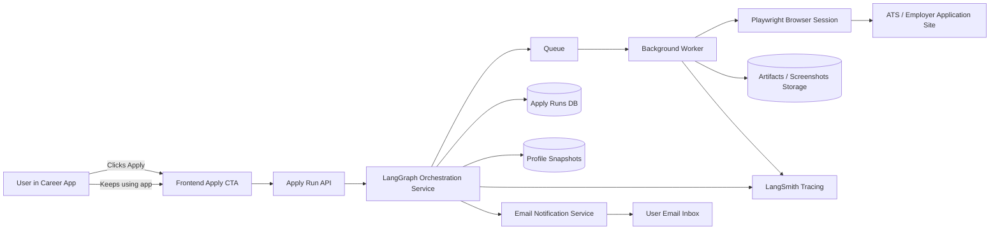
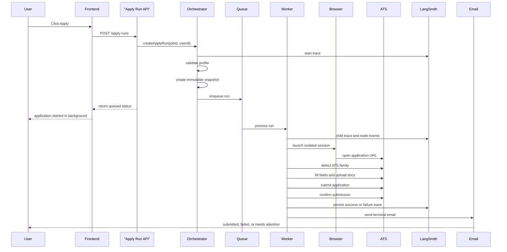
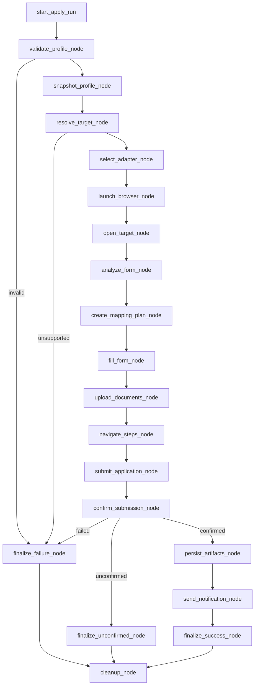
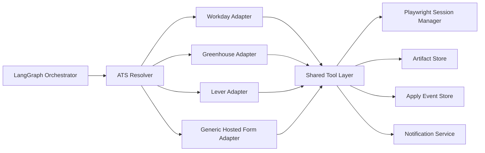

# Autonomous Apply System

This document is the canonical home for the autonomous apply diagrams.

It reflects the intended backend-only apply architecture with these core assumptions:

- the reusable application profile remains the first apply gate
- after readiness is satisfied, `Apply` creates a background run and returns immediately
- there is no user approval step before submission
- LangGraph orchestrates a deterministic workflow
- LangSmith captures end-to-end traces and node-level visibility
- Playwright runs in isolated worker sessions

## Diagram map

1. High-level architecture
2. Async sequence flow
3. LangGraph node flow
4. Adapter model

## 1. High-level architecture

## 2. Async sequence flow

## 3. LangGraph node flow

## 4. Adapter model

