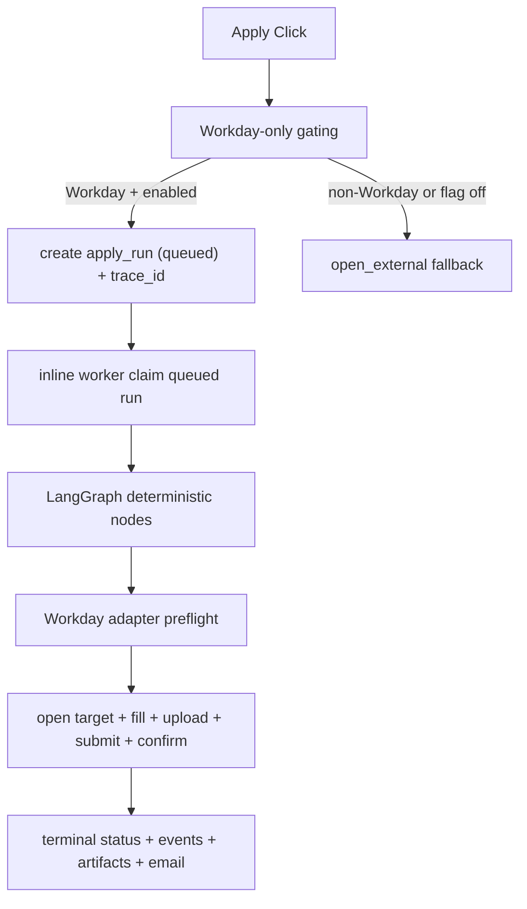

# Autonomous Apply System (Current Workday-Only Reality)

This document describes the production implementation as it exists today.

## Scope

- autonomous apply is feature-flagged (`AUTONOMOUS_APPLY_ENABLED`)
- autonomous submission is implemented end to end for Workday targets only
- Greenhouse, Lever, and generic hosted forms are detected but not automated in this phase
- non-Workday targets are gated to `open_external` before run creation
- worker execution is inline/in-process with bounded concurrency

## Routing And Gating

`/api/v1/jobs/apply-click` and `/api/v1/apply-runs` use explicit Workday-only routing:

1. resolve target ATS family
2. if feature flag off -> return `open_external` (`feature_flag_off`)
3. if target is non-Workday -> return `open_external` (`unsupported_target_for_autonomous_mode`)
4. if Workday + enabled -> queue autonomous apply run

Diagnostic markers are emitted for:

- `feature_flag_off`
- `unsupported_target_for_autonomous_mode`
- `auth_missing`
- `profile_incomplete`
- `queued_workday`

## Runtime Flow

## Workday Hardening Behaviors

- explicit login-required detection (`LOGIN_REQUIRED`)
- explicit CAPTCHA detection (`CAPTCHA_ENCOUNTERED`)
- deterministic required-field-unmapped handling (`REQUIRED_FIELD_UNMAPPED`)
- deterministic document and upload failures (`REQUIRED_DOCUMENT_MISSING`, `FILE_UPLOAD_FAILED`)
- explicit submit-blocked handling (`SUBMIT_BLOCKED`)
- timeout classification across navigation/steps/submit/confirmation (`TIMEOUT`)
- ambiguous post-submit confirmation is persisted as `submission_unconfirmed` with `SUBMISSION_NOT_CONFIRMED`
- cleanup/error handling does not overwrite terminal truth

## Status And Visibility

Authenticated status visibility is available through:

- `GET /api/v1/apply-runs` (list + timeline summary + alertable state markers)
- `GET /api/v1/apply-runs/:runId` (detail + full events timeline)
- UI pages:
  - `/account/apply-runs`
  - `/account/apply-runs/:runId`

Alertable state markers:

- `stuck_queued`
- `stuck_in_progress`

## Trace Correlation

Every newly queued Workday run gets a `trace_id` generated at or before run creation.

Correlation path:

1. API request/correlation metadata on `apply_runs.metadata_json`
2. `apply_runs.trace_id`
3. `apply_run_events.trace_id`
4. LangSmith metadata and tags (`trace:<trace_id>`, `run:<run_id>`)

## Worker Architecture Notes

- current mode: inline worker, in-process
- bounded with `AUTONOMOUS_APPLY_INLINE_WORKER_CONCURRENCY` (max 4)
- batch cap via `AUTONOMOUS_APPLY_WORKER_BATCH_SIZE`
- retry behavior is intentionally conservative in inline mode to avoid duplicate submissions
- artifact retention cleanup hook is available and controlled via env

## Deferred (Not In This Phase)

- autonomous submission for Greenhouse
- autonomous submission for Lever
- autonomous submission for generic hosted forms
- dedicated out-of-process worker architecture
