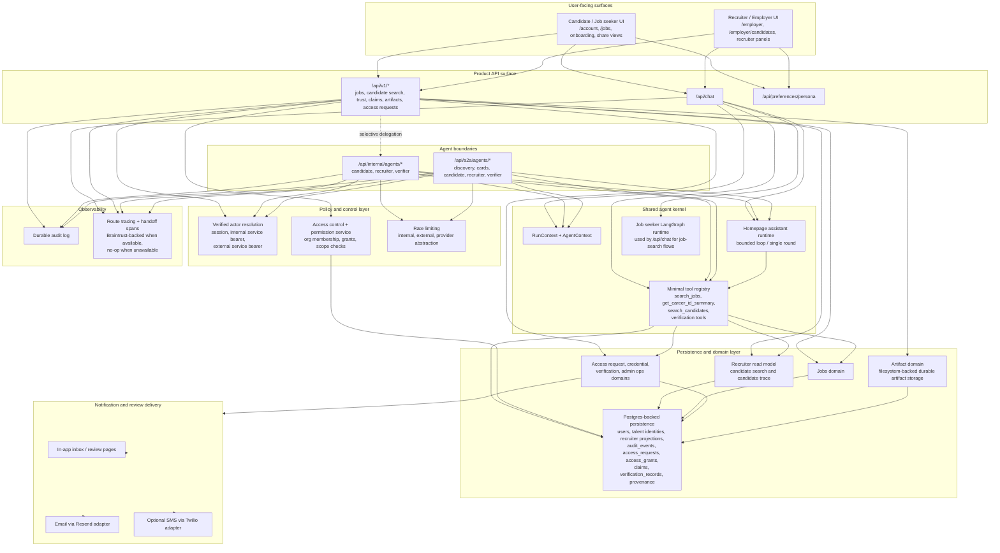
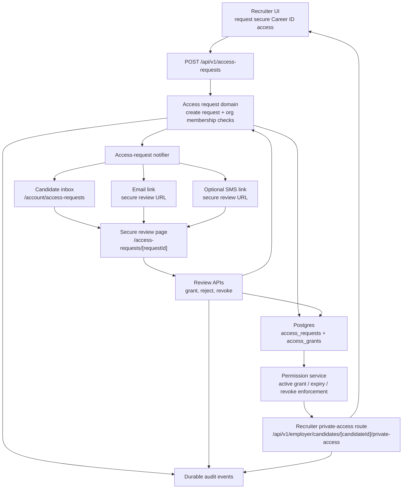
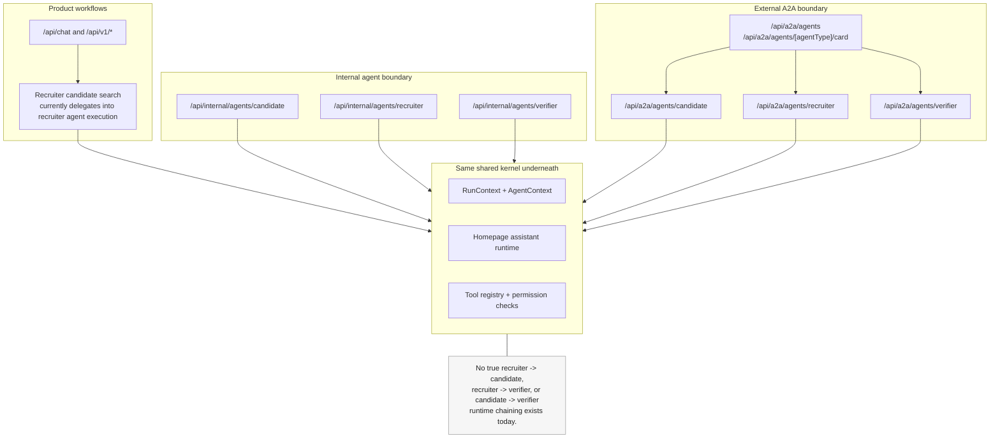

# Current-State Agent Platform

## Executive summary

Career AI is currently a single Next.js application that combines:

- user-facing candidate and recruiter product surfaces
- product APIs under `/api/chat` and `/api/v1/*`
- internal agent endpoints under `/api/internal/agents/*`
- external A2A-compatible endpoints under `/api/a2a/agents/*`
- a shared agent kernel built from the homepage assistant runtime, agent context/run context utilities, and the model-callable tool registry

Today, the platform has three distinct execution patterns:

1. direct product workflows
2. product-to-agent handoff
3. internal or external agent boundary calls

The important current-state proof point is this:

- the recruiter candidate-search product flow now crosses the recruiter agent boundary and emits real handoff trace events while keeping the browser contract unchanged

That proof is limited to recruiter candidate search. The rest of the product still mixes direct domain/service calls, `/api/chat` runtime execution, and trust workflow routes that do not yet route through internal or external agent endpoints.

## High-level platform architecture

## Product flow diagram

The currently proven product-to-agent handoff is recruiter candidate search. The browser still calls the existing product API. The product route now delegates server-side into the recruiter agent execution path.

```mermaid
flowchart LR
  RecruiterUser["Recruiter UI\nHero composer / sourcing panel"]
  BrowserFetch["POST /api/v1/employer/candidates/search"]
  ProductRoute["Product route\nkeeps EmployerCandidateSearchResponseDto stable"]
  Auth["resolveVerifiedActor\nsession-aware"]
  Delegator["recruiter-product-search helper"]
  ParentRun["createRunContext\nparent run"]
  RecruiterCtx["buildRecruiterAgentContext\nchild run + org context"]
  Handoff["agent.handoff.start/authz/dispatch/complete"]
  Search["searchEmployerCandidates(...)"]
  Projections["Recruiter candidate projections\nin persistence"]
  ProductResponse["Same search DTO back to browser"]

  RecruiterUser --> BrowserFetch --> ProductRoute
  ProductRoute --> Auth
  Auth --> Delegator
  Delegator --> ParentRun
  ParentRun --> RecruiterCtx
  RecruiterCtx --> Handoff
  Handoff --> Search
  Search --> Projections
  Projections --> Search
  Search --> ProductResponse
  ProductResponse --> RecruiterUser
```

### Important note on this flow

- This is a real product-to-agent boundary crossing.
- It does **not** make an HTTP call from `/api/v1/employer/candidates/search` to `/api/internal/agents/recruiter`.
- It reuses the same recruiter-agent execution primitives in-process: run context, recruiter agent context, handoff tracing, and recruiter-safe search behavior.

## Trust workflow diagram

The trust lifecycle remains a direct product workflow, not an agent-to-agent workflow.

## A2A boundary diagram

The platform has both internal and external agent boundaries on top of the same kernel. True cross-agent chaining is **not** implemented yet.

## Route and boundary mapping

### Product routes

These are user-facing application routes and APIs.

| Route family | Current role |
| --- | --- |
| `/api/chat` | Main chat entry point. Uses the shared runtime directly for general chat and the LangGraph runtime for job-seeker job-search flows. |
| `/api/v1/jobs*` | Jobs product APIs and retrieval surface. |
| `/api/v1/employer/candidates/search` | Recruiter candidate search product API. This now delegates into recruiter agent execution for authenticated recruiter or hiring-manager sessions. |
| `/api/v1/employer/candidates/trace` | Recruiter-safe candidate detail API. Still direct. |
| `/employer/candidates` | Recruiter candidate detail page. Still server-side direct read-model execution. |
| `/api/v1/access-requests*` | Recruiter request creation, candidate review, and revocation lifecycle. Direct trust workflow. |
| `/api/v1/employer/candidates/[candidateId]/private-access` | Private recruiter profile read, enforced by current permission service and active-grant checks. |
| `/account/access-requests` and `/access-requests/[requestId]` | Candidate inbox and secure review page. Server-rendered trust workflow surfaces. |

### Internal agent routes

These routes are internal-service-only agent boundaries. They require verified internal bearer auth and are not intended for direct browser use.

| Route | Current role |
| --- | --- |
| `/api/internal/agents/candidate` | Candidate-scoped internal agent entry point. |
| `/api/internal/agents/recruiter` | Recruiter-scoped internal agent entry point. |
| `/api/internal/agents/verifier` | Verifier-scoped internal agent entry point. |

### External A2A routes

These routes are the first external-facing A2A-compatible boundary. They require external bearer auth and remain separate from current product UI flows.

| Route | Current role |
| --- | --- |
| `/api/a2a/agents` | External discovery surface. |
| `/api/a2a/agents/[agentType]/card` | External agent card / capability discovery. |
| `/api/a2a/agents/candidate` | External candidate agent endpoint. |
| `/api/a2a/agents/recruiter` | External recruiter agent endpoint. |
| `/api/a2a/agents/verifier` | External verifier agent endpoint. |

### Which frontend flows currently cross the agent boundary

| Product flow | Current state |
| --- | --- |
| Recruiter candidate search | **Crosses the recruiter agent boundary** via the product route delegation helper behind `/api/v1/employer/candidates/search`. |
| Candidate chat through `/api/chat` | Uses shared runtime directly, but **does not** cross the internal or external agent route boundary. |
| Employer chat through `/api/chat` | Still direct `/api/chat` logic. Employer candidate-search intent inside chat still uses direct recruiter read-model search. |
| Candidate inbox / secure review / revoke | Direct trust workflow. **Does not** cross agent boundary. |
| Recruiter candidate detail trace | Direct read-model flow. **Does not** cross agent boundary. |

## Observability and tracing

### What tracing exists now

- route-level trace roots are created with `withTracedRoute`
- request-scoped trace metadata is stored in `AsyncLocalStorage`
- spans are emitted with `traceSpan`
- handoff events are emitted with `emitAgentHandoffEvent` and `traceAgentHandoff`
- Braintrust is used when the package and environment are available
- tracing degrades safely to no-op spans when Braintrust is unavailable
- durable audit events are written separately to `audit_events`

### Current request metadata

Common route traces currently carry metadata such as:

- `route_name`
- `trace_id`
- `request_id`
- `actor_type`
- `owner_id`
- `run_id`
- `session_id`
- `user_id`

Handoff traces currently add metadata such as:

- `source_agent_type`
- `target_agent_type`
- `handoff_type`
- `handoff_reason`
- `operation`
- `parent_run_id`
- `child_run_id`
- `permission_decision`
- `source_endpoint`
- `target_endpoint`
- `a2a_protocol_version`
- `a2a_request_id`

### Handoff spans that exist now

- `agent.handoff.start`
- `agent.handoff.authz`
- `agent.handoff.dispatch`
- `agent.handoff.complete`
- `agent.handoff.denied`

### What has been proven by real traced flow

The following has been proven in a real product flow:

- recruiter candidate search from the recruiter UI
- browser call to `/api/v1/employer/candidates/search`
- server-side delegation into recruiter agent execution
- handoff trace emission with recruiter target metadata and parent/child run relationship

### What is still not proven by current product traces

- recruiter candidate detail trace routed through agent boundary
- access-request lifecycle routed through agent boundary
- product UI invoking `/api/internal/agents/*` directly
- product UI invoking `/api/a2a/agents/*` directly
- true agent-to-agent chaining between recruiter, candidate, and verifier runtimes

### Trace types in practice

| Trace type | Current meaning |
| --- | --- |
| Chat trace | `/api/chat` route plus shared-runtime or job-seeker graph spans. |
| Product workflow trace | `/api/v1/*` or server-rendered product flow spans. May be direct service execution or delegated execution. |
| Internal agent handoff trace | Internal service or delegated product path crossing into an internal agent execution path. |
| External A2A boundary trace | External bearer-authenticated A2A discovery or agent invocation route traces with protocol/version metadata. |

## Current known limitations

- Only recruiter candidate search is currently proven as a real product-to-agent handoff.
- Recruiter candidate detail trace still bypasses the agent layer.
- Access-request creation, approval, rejection, and revocation are still direct trust workflows.
- `/api/chat` in employer mode still performs direct recruiter read-model candidate search for employer candidate-search intent.
- The product does not currently perform true recruiter-to-candidate or recruiter-to-verifier runtime chaining.
- External A2A routes exist, but the current browser product does not use them.
- Internal agent routes exist as HTTP boundaries, but the current product mostly does not call them directly; the proven recruiter search integration reuses the same boundary semantics in-process.
- Rate limiting is abstracted behind a provider interface, but the current implementation is still in-memory and process-local.
- Durable artifact storage currently uses a filesystem adapter under `.artifacts`; object storage is not implemented.
- Notification delivery is provider-dependent and may be skipped when Resend, Twilio, or related env configuration is unavailable.

## Recommended next integration targets

The next highest-value product flows to route through the agent boundary are:

1. recruiter candidate detail trace via `/api/v1/employer/candidates/trace` and `/employer/candidates`
2. employer candidate-search behavior inside `/api/chat`
3. read-only verifier or review surfaces where agent-scoped trust context would add value without introducing mutation risk

## Implementation anchors

Useful implementation entry points for this document:

- `app/api/chat/route.ts`
- `app/api/v1/employer/candidates/search/route.ts`
- `lib/internal-agents/recruiter-product-search.ts`
- `app/api/internal/agents/_shared.ts`
- `app/api/internal/agents/recruiter/route.ts`
- `app/api/a2a/agents/_shared.ts`
- `app/api/a2a/agents/recruiter/route.ts`
- `lib/internal-agents/registry.ts`
- `lib/a2a/registry.ts`
- `packages/agent-runtime/src/context.ts`
- `packages/agent-runtime/src/tools.ts`
- `packages/audit-security/src/access-control.ts`
- `packages/persistence/src/audit-log-repository.ts`
- `packages/persistence/src/access-control-repository.ts`
- `packages/artifact-domain/src/storage.ts`
- `lib/notifications/access-request-notifier.ts`
