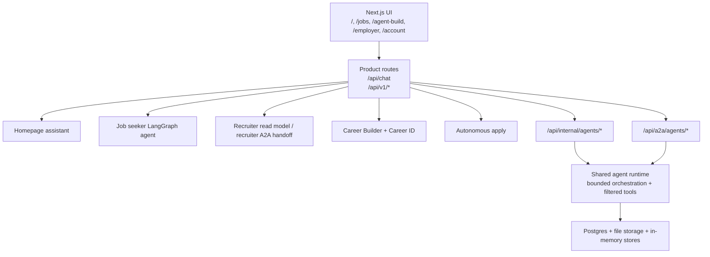

# Current-State System Architecture

Career AI is a single Next.js application with optional sibling services and workspace packages in the same repo. The current implementation mixes direct product routes, a LangGraph job-seeker runtime, bounded-loop internal and external agent endpoints, Postgres-backed persistence, and a few still-in-memory domain stores.

## Runtime Surfaces

- `/api/chat` is the main chat boundary. It resolves a chat actor, persists the user message, and then chooses recruiter search, the job-seeker agent, or the homepage assistant.
- `/api/v1/jobs/*` exposes job ingestion, latest browse, search, validation, detail, and apply-click APIs.
- `/api/v1/employer/candidates/search` is the recruiter product-search route. Recruiter and hiring-manager sessions delegate through the recruiter A2A boundary in-process; other callers fall back to the direct recruiter read model.
- `/api/v1/career-builder/*` runs Career Builder profile, phase, and evidence flows. Offer-letter verification can call the optional `api-gateway` integration.
- `/api/v1/career-id/verifications/*` implements Persona-backed government-ID verification session creation, status reads, webhook handling, and retry.
- `/api/v1/apply-runs/*` creates and inspects autonomous-apply runs.

## Agent Systems

### Homepage assistant

- The homepage assistant lives in `packages/homepage-assistant/src/service.ts`.
- Default mode is single-round OpenAI Responses unless `CAREER_AI_ENABLE_BOUNDED_AGENT_LOOP=true` or the caller explicitly requests `runtimeMode: "bounded_loop"`.
- Internal and external agent endpoints force bounded-loop mode and pass a filtered tool registry.

### Job seeker agent

- The job-seeker runtime lives in `packages/job-seeker-agent/src`.
- It uses LangGraph with a bounded graph: `observe_context`, `classify_intent`, `plan_next_action`, `execute_tool`, `evaluate_tool_result`, `fallback_or_clarify`, `respond`.
- It is only used from `/api/chat`, not from the internal or A2A agent endpoints.

### Internal agent boundary

- `/api/internal/agents/candidate`
- `/api/internal/agents/recruiter`
- `/api/internal/agents/verifier`
- These routes require `internal_service_bearer` auth, reserve quota, build an `AgentContext`, and invoke the homepage assistant in bounded-loop mode with a filtered subset of the shared agent tool registry.

### External A2A boundary

- Discovery: `GET /api/a2a/agents`
- Cards: `GET /api/a2a/agents/[agentType]/card`
- Agents: `POST /api/a2a/agents/candidate`, `POST /api/a2a/agents/recruiter`, `POST /api/a2a/agents/verifier`
- These routes are disabled unless `EXTERNAL_A2A_ENABLED=true`.
- Caller auth comes from `EXTERNAL_AGENT_AUTH_TOKENS`, which binds bearer tokens to a service name and an allowed agent set.
- The recruiter endpoint supports both `respond` and `candidate_search`. The `candidate_search` operation is deterministic and calls `searchEmployerCandidates` directly instead of running a model loop.

### Tool registries

- The job-seeker tool registry is separate from the shared agent-runtime registry. It includes `browseLatestJobs`, `findSimilarJobs`, `getJobById`, `getUserCareerProfile`, `searchJobs`, and `search_web`.
- The shared agent-runtime registry backs the internal and A2A agents. Its callable tools are `search_jobs`, `get_career_id_summary`, `search_candidates`, `get_claim_details`, `get_verification_record`, and `list_provenance_records`.
- Tool permission checks are enforced server-side. Recruiter-only tools require recruiter or hiring-manager roles, and claim / verification tools also check subject access.

## Persistence And Storage Boundaries

### Durable when `DATABASE_URL` is configured

- Users, onboarding, talent identity, privacy, soul-record, and career-builder tables.
- Jobs feed snapshots, job postings, validation events, search events, and apply-click events.
- Recruiter candidate projections.
- Chat projects, conversations, messages, attachments, checkpoints, memory records, memory jobs, and chat audit events.
- Audit events when `DURABLE_AUDIT_LOGGING` is not disabled.
- Autonomous-apply runs and events.
- A2A protocol tables: `agent_messages`, `agent_runs`, `agent_handoffs`, `agent_task_events`.

### Local-file fallback

- Chat workspace manifest: `.artifacts/chat/state.json`
- Chat attachment bytes: `.artifacts/chat/files/*`

### Still in memory

- Verification-domain store
- Credential-domain store
- Artifact-domain metadata and in-memory file maps
- Recruiter share-profile summaries and trust summaries
- In-memory portions of the audit store

Those stores reset on process restart unless another domain also writes a durable projection.

### Blob / artifact storage

- Artifact-domain blob storage uses the filesystem by default.
- Setting `CAREER_AI_BLOB_STORAGE_DRIVER=s3` or bucket settings switches the artifact driver to S3.
- Autonomous-apply external worker mode is only considered queue-ready when shared S3 storage is available.

## Observability

- `withTracedRoute` and `traceSpan` wrap `/api/chat`, `/api/internal/agents/*`, `/api/a2a/agents/*`, and selected `/api/v1/*` routes.
- Braintrust tracing is optional. When `BRAINTRUST_API_KEY` is absent, tracing falls back to a no-op span implementation.
- `x-trace-debug: true` requests observed-span headers on traced routes when Braintrust is available.
- `/api/v1/health` reports degraded status when database-backed services are unavailable. Artifact, credential, verification, recruiter-read-model, and audit services can still report `up` because they have in-memory fallbacks.
- A2A protocol events are written to Postgres only when `DATABASE_URL` is configured. Without a database, the routes still run but protocol persistence is skipped.

## Background Execution And Feature Flags

- Jobs feed refresh is request-triggered from the jobs domain. There is no scheduler in this repo.
- Chat memory extraction runs inline after assistant persistence in DB-backed chat mode. `chat_memory_jobs` is a durable queue record, not a separate worker process.
- Autonomous apply supports inline and worker-loop execution. The loop can run inside the app process or through `scripts/run-autonomous-apply-worker.ts`.

Major runtime flags:

- `AUTONOMOUS_APPLY_ENABLED`: enables run creation for supported ATS targets.
- `AUTONOMOUS_APPLY_WORKER_MODE`: `inline`, `external`, or `disabled`.
- `JOB_SEARCH_RETRIEVAL_V2_ENABLED`: switches jobs search to the v2 canonical retrieval path.
- `EXTERNAL_A2A_ENABLED`: turns on external A2A discovery and invoke endpoints.
- `CAREER_AI_ENABLE_BOUNDED_AGENT_LOOP`: changes default homepage assistant mode outside routes that force bounded mode.
- `CAREER_AI_ENABLE_RECRUITER_DEMO_DATASET`: controls demo candidate backfill for recruiter search / trace.
- `PERSIST_SERVER_PERSONA_PREFERENCE`: controls whether `/api/preferences/persona` writes to the database.
- `DURABLE_AUDIT_LOGGING`: controls whether audit events are persisted to Postgres.

## Current Limits

- There is no general multi-agent chaining runtime. Internal and external agents are isolated request/response endpoints.
- Several trust-domain stores are still process-local.
- Not every product flow crosses an agent boundary; many routes still call domain services directly.
