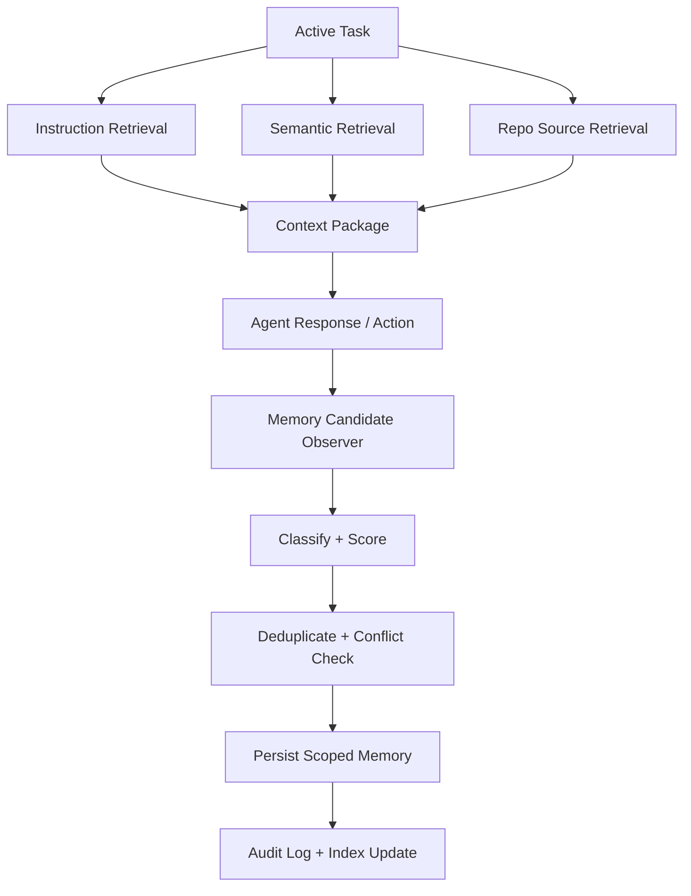

# Memory Architecture

## Objective

Add an enterprise-grade semantic memory service on top of the existing memory layers without replacing the layers that already work well.

## Existing layers

The current system already has these persistence layers:

1. working memory in the active run and thread
2. session transcripts and archived sessions
3. thread metadata and orchestration state
4. global UI and workspace state
5. instructional memory through `AGENTS.md`
6. procedural memory through skills
7. source-of-truth project memory through repo files, commits, and pull requests

## Missing layer

The missing layer is durable semantic memory: normalized, scoped, auditable facts that improve future work without replacing the repo or leaking unstable context into long-term storage.

## Design goals

- deterministic storage
- explicit retrieval before generation
- provenance on every saved fact
- scope isolation
- deduplication and contradiction detection
- easy correction and deletion
- safe defaults that reject noisy memory candidates

## Architecture

## Layer precedence

1. instruction memory sets behavior and guardrails
2. repo and file sources remain authoritative when they exist
3. semantic memory provides stable reusable facts with provenance
4. session memory supports thread continuity but is not long-term truth
5. working memory is temporary and should never be treated as durable truth

## Current gap analysis

### What is already strong

- session and thread persistence
- instruction durability through `AGENTS.md`
- procedural durability through skills
- auditable source-of-truth through git and repo docs

### What is missing

- typed semantic memory records
- write gating and confidence thresholds
- scoped semantic stores
- retrieval traces
- contradiction and duplicate handling
- admin controls for inspect, edit, delete, and trace

## Migration plan

### Phase 1

Introduce semantic memory as a new standalone subsystem under `/memory`.

### Phase 2

Keep repo, instruction, and session layers intact. Do not migrate them into semantic memory.

### Phase 3

Require retrieval traces before semantic memory is used in responses.

### Phase 4

Add compaction, reconciliation, and admin tools before enabling automatic write paths in production.

### Phase 5

Integrate runtime retrieval in the order:

1. instruction
2. scoped semantic
3. repo source-of-truth

Then evaluate whether any candidate fact is stable enough to enter semantic memory.

## Runtime integration order

1. load task
2. retrieve instruction memory
3. retrieve scoped semantic memory
4. retrieve repo/source-of-truth context
5. build a context package
6. act
7. evaluate new memory candidates
8. write only through the gated semantic write pipeline

## Safety model

- semantic memory stores normalized facts, not transcripts
- every saved record must include provenance, scope, timestamp, and confidence
- repo facts should point back to docs or files instead of duplicating source-of-truth blindly
- thread facts must not be promoted automatically to global memory
- deleted and superseded memories remain auditable through status changes and audit events
